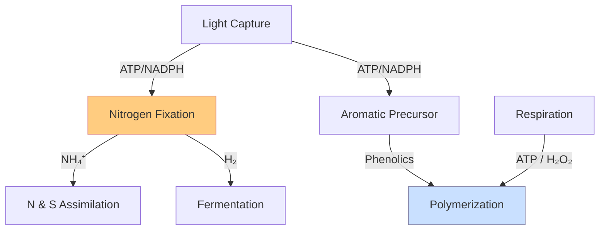
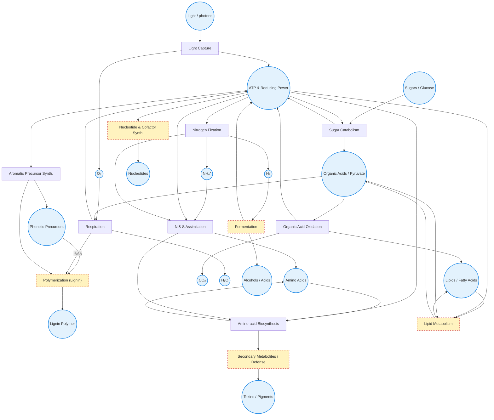

 **The guiding principles are:**
- **Self-contained loops.** Each block can run on its own once it has its feed-stocks.
- **Minimal cross-talk.** Only a few generic “currencies” ( **ATP** for energy, **reducing power** as NADH / NADPH, and a handful of **precursor molecules** ) flow between blocks.
- **Clear thematic focus.** Every block feels different for the player (light capture vs. fermentation vs. lipid storage, etc.).

---
### 1 Currency hub (very small, highly connected)

| Currency                          | Generated by                             | Consumed by                                |
| --------------------------------- | ---------------------------------------- | ------------------------------------------ |
| **ATP** (energy)                  | Light Capture, Respiration, Fermentation | _almost all_ blocks                        |
| **Reducing Power** (NADH / NADPH) | Catabolism, Light Capture                | Biosynthetic blocks, Respiration           |
| **Acetyl-CoA**                    | Sugar Catabolism, β-Oxidation            | Lipid Synthesis, TCA Cycle                 |
| **Carbon Skeletons**              | Sugar Catabolism, TCA Cycle              | Amino-, Nucleotide-, Cofactor biosynthesis |
|                                   |                                          |                                            |

> _In-game you can implement these as tiny “bank” pools shared by the larger blocks, so the blocks stay sparsely interconnected._

---
### 2 The macro-blocks (sparse graph)

| Block (Module)                         | Real-world pathway core                 | Key Inputs                        | Internal Loop Produces            | Main Exports                                    | Direct Edges (few!)                         |
| -------------------------------------- | --------------------------------------- | --------------------------------- | --------------------------------- | ----------------------------------------------- | ------------------------------------------- |
| **Light Capture**                      | Photosystems I/II, photophosphorylation | photons, H₂O                      | proton gradient                   | ATP, NADPH, O₂                                  | exports only; no imports                    |
| **Sugar Catabolism**                   | Glycolysis + Pentose-P Pathway          | glucose, ATP (seed)               | pyruvate, NADH                    | ATP, NADH, pyruvate, ribose-5-P                 | → Organic Acid Ox, Nucleotide block         |
| **Organic Acid Oxidation**             | Pyruvate → TCA cycle                    | pyruvate, CoA                     | NADH, FADH₂, CO₂                  | NADH, acetyl-CoA, precursor acids               | → Respiration, Lipid block                  |
| **Respiration**                        | Electron Transport Chain                | NADH / FADH₂, O₂ / alt acceptor   | proton gradient                   | large ATP                                       | feeds ATP pool                              |
| **Fermentation (Alt Energy)**          | Lactate / ethanol paths                 | pyruvate, NADH                    | redox balance                     | small ATP, specialty alcohols / acids           | alternative to Respiration                  |
| **Nitrogen & Sulfur Assimilation**     | GS-GOGAT, APS/PAPS paths                | ATP, NH₄⁺, SO₄²⁻, reducing power  | glutamate, cysteine               | amino-acid precursors                           | → Amino-acid block                          |
| **Amino-acid Biosynthesis**            | multiple                                | precursor acids, NH₄⁺, ATP, NADPH | branch-chain loops                | amino acids                                     | → Protein / Secondary                       |
| **Lipid Metabolism**                   | Fatty-acid synth./β-oxid.               | acetyl-CoA, ATP, NADPH            | fatty acyl-ACP ↔ β-oxidation loop | storage fats, membranes, acetyl-CoA (from β-ox) | bidirectional with Organic Acid Ox          |
| **Nucleotide & Cofactor Biosynthesis** | PRPP, purine/pyrimidine de-novo         | ribose-5-P, amino acids, ATP      | PRPP ↔ purine loop                | nucleotides, NAD⁺, FAD                          | minor edge from Sugar Catab.                |
| **Secondary Metabolites / Defense**    | polyketide / terpenoid / NRPS           | acetyl-CoA, amino acids, ATP      | iterative condensation loops      | toxins, pigments, signals                       | optional edge from multiple precursor pools |

**Connectivity sketch (edges):**  
Light → (ATP / NADPH pool)  
Sugar Catab. → Organic Acid Ox  
Organic Acid Ox → Respiration (via NADH) and Lipid (via acetyl-CoA)  
Sugar Catab. → Nucleotide (via ribose-5-P)  
Assimilation → Amino-acids  
Minimal or no lateral edges between biosynthetic blocks.

---

### 3 How this plays as game modules

| Design lever               | Example implementation                                                                                       |
| -------------------------- | ------------------------------------------------------------------------------------------------------------ |
| **Throughput caps**        | Each block has limited enzyme-slot upgrades; bottlenecks force players to expand or re-route.                |
| **Stoichiometric recipes** | e.g. _Glycolysis_: 1 Glucose + 1 ATP → 2 ATP + 2 NADH + 2 Pyruvate.                                          |
| **Feedback hooks**         | Excess NADH inhibits Sugar` Catabolism unless Respiration is active — creates tension in anaerobic maps.     |
| **Specialist yields**      | Secondary block can convert surplus amino acids + ATP into pigments that boost morale / defense stats.       |
| **Tech tree flavor**       | Unlocking Lipid β-Oxidation lets the player “burn fat” when glucose is scarce, mirroring fasting metabolism. |

---
###  4     The genome

At the starting location (vent type) you can begin with different prebiotic metabolites, and form rna polymers into a primitive genome. This, like a Pokémon starter, determines your early game metabolism. Adding further metabolic blocks requires integrating the enzymes of those pathways into your genome. To optimise this, you want to be doing metabolic tinkering ie. reusing some of what you already have.

---
### 5 Tuning tips

1. **Limit shared currencies to three-four types.** That alone keeps the graph sparse.
2. **Gate rare inputs** (e.g. sulfate, photons) by biome or era to stagger which blocks are attractive.
3. **Let waste build-up matter.** CO₂ or organic acids can become soft caps unless the player invests in the right block (Respiration or Fermentation).
4. **Mirror real trade-offs**: high ATP yield (Respiration) vs. quick but dirty (Fermentation).
5. **Visual aid:** show blocks as hexes connected only by the few edges above, with currency lines colored by type — easy for players to read at a glance.

