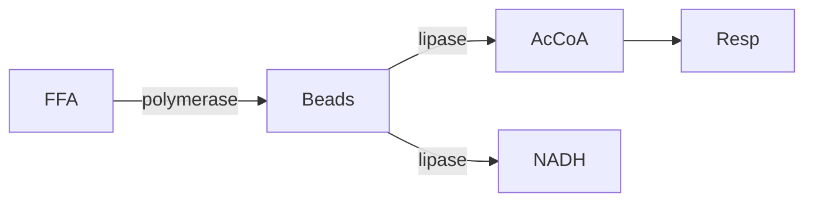

# Fermentation, Waste‑Routing & Defensive Chemistry – Design Summary

## 1 Fermentation Block (core loop)

* **Inputs:** Pyruvate + NADH
* **Outputs:** Small ATP + organic‑waste (ethanol, lactate, acetate)
* Runs passively; the player opens a *Tuning UI* to adjust flux, strain regulation and vesicle export.
* Unmanaged waste causes toxic back‑pressure that throttles ATP yield.

---

## 2 Waste‑Stream Destinies

| Path                               | Enzymes                 | Feeds/Produces     | Pay‑off                      | Caveat                      |
| ---------------------------------- | ----------------------- | ------------------ | ---------------------------- | --------------------------- |
| **Ethanol → Acetate → Acetyl‑CoA** | Alcohol/aldehyde DH set | Lipid & TCA blocks | Salvage carbon for extra ATP | Needs O₂ later              |
| **Lactate ↔ Pyruvate**             | Lactate DH              | Organic‑Acid Ox    | Redox balance                | Local acid stress           |
| **Acetate → Polyhydroxybutyrate**  | PHA synthase            | *Poly‑mer* Storage | Famine buffer                | Adds mass                   |
| **Acid waste → Proton pump**       | Membrane pump           | ATP synthase tap   | Extra ATP                    | Membrane damage if overused |
| **Ethanol/Butanol → Toxins**       | Tailoring PKS / NRPS    | Defense Block      | Predator control             | Self‑toxicity risk          |
| **Volatiles → Auto‑inducers**      | Autoinducer synthase    | Symbiont AI        | Buff symbionts               | Parasite hijack             |

### Flow‑Map Interface

* Drag‑and‑drop graph; edges route fractions of waste to chosen converters.
* **Fallback export** prevents stalls but lowers efficiency.
* Nodes colour‑shift blue→red with back‑pressure; “Stress Test” doubles flux briefly.

---

## 3 Poly‑mer Fatty‑Acid Storage Block

* **Polymerisation:** Free FA + ATP → Storage Beads.
* **Mobilisation:** Beads → Acetyl‑CoA + NADH for respiration.
* Each bead increases *CurrentMass* → lowers top speed & turn rate, raises collision damage.
* UI: Fill gauge, target‑fill slider, lipolysis throttle, stress alerts.
* Failure loops: bead capacity full ⇒ membrane stress; ATP blackout stalls polymerase; over‑sluggish vs. predators.



---

## 4 Defense Toxins from Fermentation Waste

| Archetype           | Waste Feed   | Deploy Mode   | Effect      | Side‑Effect    |
| ------------------- | ------------ | ------------- | ----------- | -------------- |
| **Fusel Burst**     | Ethanol line | Puff cloud    | Stun + slow | Blurs vision   |
| **Polyketide Slug** | Acetate line | Sticky coat   | HP drain    | Adds mass      |
| **Foam Screen**     | Lactate line | Barrier strip | Blocks LOS  | Large ATP cost |

* Produced in *Secondary Metabolites/Defense* block; potency scales with ATP & enzyme tier.
* Cytosolic reservoir with auto‑purge option; overfill causes **Cytotoxic Stress**.

---

## 5 ECS Skeleton Highlights (Bevy)

```rust
// Fermentation → Waste routing
struct WastePool(f32);
struct ToxinReservoir { cur: f32, cap: f32 }
struct StorageBeads(f32);

// Systems
fermentation_system
route_waste_system
polymerize_beads_system
lipolysis_system
autopurge_toxins_system
movement_dynamics_system
stress_monitor_system
```

---

## 6 Design Take‑aways

* **Intentional loops** reward the player with efficiency/defense but add brittleness.
* **Mass vs. Energy**: Poly‑mer ties mobility to famine insurance.
* **Waste as Weapon**: Tailoring enzymes convert liabilities into situational tools.
* Sparse currency & limited enzyme slots keep the macro‑graph readable and strategic.
